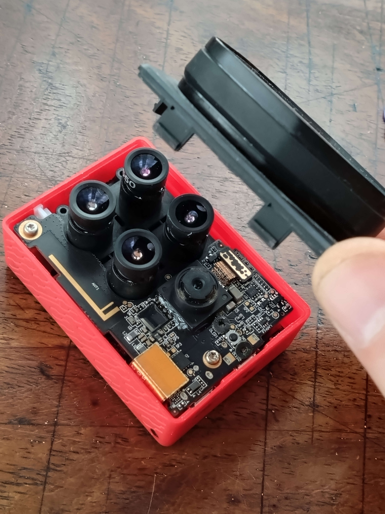
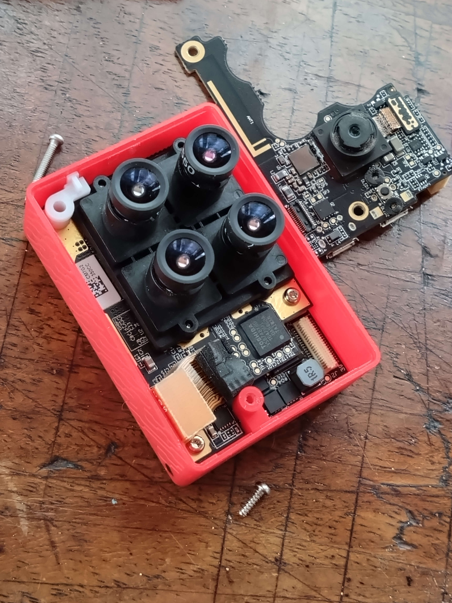
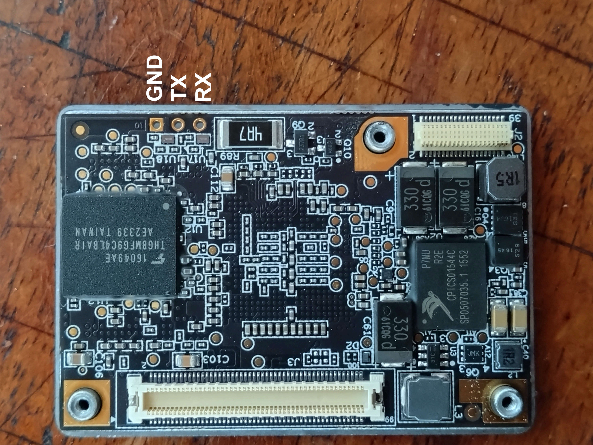

# Disassembly of the Parrot Sequoia

## Step 1
Pry open the Sequoia from the top (Camera side) using a plastic tool to avoid scratching it

## Step 2
Remove the 2 torx screws (using a Torx 6 screwdriver)

## Step 3
Remove the 2 torx screws (using a Torx 6 screwdriver)

## Step 4
Remove the 2 torx screws (using a Torx 6 screwdriver)

## Step 5
Remove the 2 torx screws (using a Torx 6 screwdriver)

## Step 6
Remove the 2 torx screws (using a Torx 6 screwdriver)

## Step 7
If wiring for UART access, connect GND to GND, and then RX to TX and TX to RX

