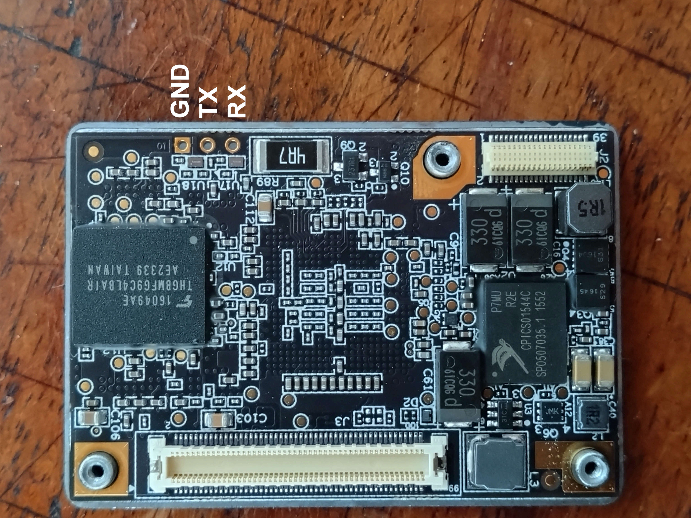

# Parrot Sequoia access information

Information on accessing the Parrot Sequoia. Use Linux to access most easily.

## Hardware reset

Push the button twice shortly and then once very long (10-20 sec).
This does reset the camera for me, but does not change anything. Parrot support claims that this means you may have to replace the camera. This repository is to try to fix it, as replacing the camera is expensive after the warranty runs out (2 years).

## RS232/UART interface logging of boot information

Materials:
- USB-to-UART/RS232 bridge device
- Torx 6 screwdriver
- Wiring

Steps:
1) Disassemble the Parrot Sequoia (see [disassembly instructions](Disassembly/Instructions.md))
2) Connect GND to GND
3) Connect RX to TX, and TX to RX
4) Reassemble the Sequoia outside of its casing.
5) Connect your USB-to-UART/RS232 bridge. On Windows, check which COM port it creates.
6) Open Putty (https://www.putty.org/), select Serial and for speed a Baud rate of 115200
7) If you want to log the outputs, select "Session -> Logging", and select your desired file name
8) Connect the Sequoia to USB for power. *IMPORTANT:* Connect it to the same device as the USB-to-UART/RS232 bridge, otherwise the power circuit could get fried



*Wiring for RS232/UART interface on Parrot Sequoia main board*

## Network map
The Parrot Sequoia is accessible through wifi on 192.168.47.1 and through USB on 10.1.1.2.

- Open ports on WIFI (192.168.47.1)
  - 21 FTP (for data access)
  - 22 SSH (requires a root password, see below how to change it)
  - 80 HTTP interface (to control the camera)
  - 53 (unknown purpose)
  - 9050 ADB shell
- Open ports on USB (10.1.1.2)
  - 21 FTP (for data access)
  - 22 SSH (requires a root password, see below how to change it)
  - 80 HTTP interface (to control the camera)
  - 9050 ADB shell

## Software access

Connect the Sequoia to the USB port of a Linux computer. Check if the Sequoia connected as a USB network device. It should show up as a `usb0` device:

```bash
ifconfig
```

If the Linux computer does not connect, give it an ip address (you may need to do this as root):

```bash
ifconfig usb0 10.1.1.7
```

You should now be able to connect through the methods below.

### ADB

On a Linux computer (ideally a Ubuntu or similar distribution):

```bash
sudo apt-get update
sudo apt-get install android-tools-adb
OR:
sudo apt-get install adb
```

Then you can log conntect to the Sequoia and remount the root partition to write onto with
```bash
adb connect 10.1.1.2:9050
adb shell mount -o remount,rw /
adb shell
```

You are now root on the Sequoia with full write permissions on the built-in Sequoia shell (Ash).

If you just want to push a file, e.g. a firmware file:
```bash
adb push sequoia_update_171.plf /update/sequoia_update.plf
```

### File system write access

To gain write access to configuration files:

```bash
mount  -o remount,rw /
```

### Enable Telnet

You can enable Telnet by editing `/etc/boxinit.d/80-telnet.rc`:

```bash
vi /etc/boxinit.d/80-telnet.rc
```

Change the third line to enabled:

```bash
service telnetd /usr/sbin/telnetd -F -l /usr/bin/shl
    class main
    enabled
```

Now `reboot` the Sequoia, and then:

```bash
telnet 10.1.1.2
```

### SSH

**_WARNING:_** Some processes will not work if a root password is set. Do this at your own risk

Use ADB or Telnet to access the shell. You can now change the root password, which will give you SSH access:

```bash
passwd
```

Then you can connect through SSH (example using wifi IP address):

```bash
ssh -o HostKeyAlgorithms=+ssh-rsa root@192.168.47.1
```

In order to reset the root password to nothing, edit the `/etc/passwd` file and set the password to `x`

```bash
vi /etc/passwd
```

## Commands

Shutdown:
```bash
sprop sys.poweroff 1
```

Reboot:
```bash
reboot
```

Factory reset:
```bash
/usr/bin/factory_reset_or_shutdown.sh reset
```

View logs:
```bash
ulogcat -C
```

Force wifi to start:
```bash
ifconfig wlan0 192.168.47.1 netmask 255.255.255.0 up
hostname Sequoia
pstart dnsmasq_wlan0
pstart hotspot_cfg
```

## Firmware downgrade

The Parrot Sequoia checks the firmware version of files that are placed in its memory. If the firmware is the same or lower than that already installed, the firmware file will be deleted and nothing happens.

At this point, doing a firmware downgrade does not seem possible. If anyone has information on this, I would appreciate it.

*NOTE:* The following commands trigger a firmware update (but not a downgrade)
```bash
pinst_trigger 1
reboot; exit
```

## Hardware documentation

- All hardware documentation is available at [Parrot's support website](https://www.parrot.com/en/support/documentation/sequoia).
- Parrot has a [Sequoia-specific forum](https://forum.developer.parrot.com/c/other-products/sequoia/15)
- A [Python implementation of the PTP protocol for the Parrot Sequoia](https://github.com/Parrot-Developers/sequoia-ptpy)
- Some information is available on the [Pix4D website](https://www.pix4d.com/product/sequoia/faq/)
- [Some information](https://ardupilot.org/dev/docs/building-for-bebop-2.html#building-for-bebop-2) on the [linux tools](https://firmware.parrot.com/Toolchains/parrot-tools-linuxgnutools-2016.02-linaro_1.0.0-5_amd64.deb) for the BeBop2

### Things to attempt:

- A Youtube user shows how [to downgrade the firmware on his Parrot BeBop](https://www.youtube.com/watch?v=xzqOPS_nmi0). Maybe the process is similar for the Sequoia:
  - Connect to the Sequoia via adb or SSH
  - `vi version.txt`
  - Reduce the version number & save
  - Restart, then apply the firmware "update"
  
- Get into P7 mode: Keep the button pressed while connecting to USB (power)
  - It may be possible to do a USB firmware downgrade using a tool called *milos_linux_installer*, see [some information here](https://forum.developer.parrot.com/t/hardware-malfunction/8164/7)
  - A further discussion is happening on the [Arducopter forums](https://discuss.ardupilot.org/t/bebop2-flashing/35116/14)


## How to

### Scanning with NMap

To find the IP address, first see if the USB network device is connected. Alternatively, you can of course also do this through the WIFI interface. Then scan it.

```bash
ifconfig
nmap -sP 10.1.1.0/24
```

Assuming that NMap yielded 10.1.1.2 for the IP address, scan the device with
```bash
ifconfig
nmap -NP 10.1.1.2
```

### Information on firmwares

- Firmware 1.7.1 uses BusyBox 1.25.0

### Boot loader access

I currently don't know how to access the boot loader exactly, or whether it's even relevant. However, it appears that the Sequoia will boot into an android-style bootloader if the button is pressed while the device gets powered on.

# Credits

Thanks to the following people
* [@Peterthegreat](https://github.com/Peterthegreat)
